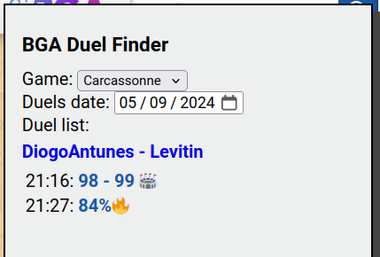

# bga-duel-finder
Find duels in BGA between a list of players


## ✨ Demo


### Screenshots



🔥 will indicate game in progress.

🏟️ will indicate arena game.

🏳️ will indicate someone conceded the game.

## 📦 Setup
Create a new bookmark in your browser that points to this "address":

    javascript:(function()%7B%2F**%0A%20*%20BGA%20Duel%20Finder.%0A%20*%0A%20*%20Script%20to%20find%20duels%20from%20a%20list%20of%20players.%0A%20*%0A%20*%20Usage%3A%0A%20*%20%201.%20Copy%20and%20paste%20this%20code%20to%20the%20developer%20console%0A%20*%20%20%20%20%20(or%20put%20it%20as%20a%20bookmarklet%20https%3A%2F%2Fcaiorss.github.io%2Fbookmarklet-maker%2F)%0A%20*%20%202.%20Pick%20game%2C%20date%2C%20and%20introduce%20duel%20list.%20For%20example%3A%0A%20*%20%20%20%20%20%20%20%20Game%3A%20Carcassonne%0A%20*%20%20%20%20%20%20%20%20Date%3A%2008%2F04%2F2024%0A%20*%20%20%20%20%20%20%20%20Duel%20list%3A%0A%20*%20%20%20%20%20%20%20%20%20%20estroncio%20-%2071st%0A%20*%20%20%20%20%20%20%20%20%20%20texe1%20-%20TheCreep74%0A%20*%20%20%20%20%20%20%20%20%20%202020Rafa%20-%20DexterLogan%0A%20*%20%20%20%20%20%20%20%20%20%20MadCan%20-%20isloun%0A%20*%20%20%20%20%20%20%20%20%20%20Loku_elo%20-%20Tarakanov28%0A%20*%20%20%20%20%20%20%20%20%20%20oscaridis%20-%20Annenmay%0A%20*%20%20%20%20%20%20%20%20%20%20thePOC%20-%20Glinka%0A%20*%0A%20*%20%203.%20Click%20'Find%20Games'.%0A%20*%2F%0A%0A(function()%20%7B%0A%20%20%20%20'use%20strict'%3B%0A%0Aconst%20REQUEST_INTERVAL%20%3D%20250%3B%20%20%20%20%20%2F%2F%20250ms%20between%20requests%2C%20give%20BGA%20a%20break%0Aconst%20CACHE_DURATION%20%3D%20604800000%3B%20%2F%2F%20One%20week%20in%20milliseconds%0A%0AcreateUi()%3B%0A%0A%2F**%0A%20*%20Check%20if%20a%20date%20is%20today%0A%20*%2F%0Afunction%20isToday(unixTimestamp)%20%7B%0A%20%20const%20today%20%3D%20new%20Date()%3B%0A%20%20const%20todayYear%20%3D%20today.getFullYear()%3B%0A%20%20const%20todayMonth%20%3D%20today.getMonth()%3B%0A%20%20const%20todayDay%20%3D%20today.getDate()%3B%0A%0A%20%20const%20date%20%3D%20new%20Date(unixTimestamp%20*%201000)%3B%0A%20%20const%20givenYear%20%3D%20date.getFullYear()%3B%0A%20%20const%20givenMonth%20%3D%20date.getMonth()%3B%0A%20%20const%20givenDay%20%3D%20date.getDate()%3B%0A%0A%20%20return%20(%0A%20%20%20%20todayYear%20%3D%3D%3D%20givenYear%20%26%26%0A%20%20%20%20todayMonth%20%3D%3D%3D%20givenMonth%20%26%26%0A%20%20%20%20todayDay%20%3D%3D%3D%20givenDay%0A%20%20)%3B%0A%7D%0A%0A%2F**%0A%20*%20Create%20ui%20for%20user%20interaction.%0A%20*%0A%20*%2F%0Afunction%20createUi()%20%7B%0A%20%20const%20uiId%20%3D%20%22bgaDuelFinderUi%22%3B%0A%20%20let%20ui%20%3D%20document.getElementById(uiId)%3B%0A%20%20if%20(ui)%20%7B%0A%20%20%20%20ui.style.display%20%3D%20%22block%22%3B%0A%20%20%20%20return%3B%0A%20%20%7D%0A%0A%20%20ui%20%3D%20document.createElement(%22div%22)%3B%0A%20%20ui.id%20%3D%20uiId%3B%0A%20%20ui.style.position%20%3D%20'fixed'%3B%0A%20%20ui.style.left%20%3D%20%220%22%3B%0A%20%20ui.style.top%20%3D%20%220%22%3B%0A%20%20ui.style.margin%20%3D%20%221em%201em%22%3B%0A%20%20ui.style.width%20%3D%20%22300px%22%3B%0A%20%20ui.style.height%20%3D%20%22600px%22%3B%0A%20%20ui.style.padding%20%3D%20%2215px%22%3B%0A%20%20ui.style.backgroundColor%20%3D%20%22%23eeefef%22%3B%0A%20%20ui.style.border%20%3D%20%222px%20solid%20black%22%3B%0A%20%20ui.style.boxShadow%20%3D%20%227px%207px%20%23444%22%3B%0A%20%20ui.style.zIndex%20%3D%20%221000%22%3B%0A%20%20ui.style.color%20%3D%20%22black%22%3B%0A%0A%20%20const%20title%20%3D%20document.createElement(%22h2%22)%3B%0A%20%20title.innerText%20%3D%20%22BGA%20Duel%20Finder%22%3B%0A%0A%20%20const%20gamePicker%20%3D%20document.createElement(%22select%22)%3B%0A%20%20gamePicker.id%20%3D%20%22finderGamePicker%22%3B%0A%20%20const%20optionsData%20%3D%20%5B%0A%20%20%20%20%20%20%7B%20value%3A%201%2C%20text%3A%20%22Carcassonne%22%20%7D%2C%0A%20%20%20%20%20%20%7B%20value%3A%2079%2C%20text%3A%20%22Hive%22%20%7D%2C%0A%20%20%20%20%20%20%7B%20value%3A%201131%2C%20text%3A%20%227%20Wonders%22%20%7D%0A%20%20%5D%3B%0A%20%20optionsData.forEach(opt%20%3D%3E%20%7B%0A%20%20%20%20%20%20const%20option%20%3D%20document.createElement(%22option%22)%3B%0A%20%20%20%20%20%20option.value%20%3D%20opt.value%3B%0A%20%20%20%20%20%20option.textContent%20%3D%20opt.text%3B%0A%20%20%20%20%20%20gamePicker.appendChild(option)%3B%0A%20%20%7D)%3B%0A%20%20const%20gamePickerLabel%20%3D%20document.createElement(%22label%22)%3B%0A%20%20gamePickerLabel.htmlFor%20%3D%20%22finderGamePicker%22%3B%0A%20%20gamePickerLabel.textContent%20%3D%20%22Game%3A%20%22%3B%0A%0A%20%20const%20datePicker%20%3D%20document.createElement(%22input%22)%3B%0A%20%20datePicker.id%20%3D%20%22finderDatePicker%22%3B%0A%20%20datePicker.type%20%3D%20%22date%22%3B%0A%0A%20%20const%20datePickerLabel%20%3D%20document.createElement(%22label%22)%3B%0A%20%20datePickerLabel.htmlFor%20%3D%20%22finderDatePicker%22%3B%0A%20%20datePickerLabel.textContent%20%3D%20%22Duels%20date%3A%20%22%3B%0A%0A%20%20const%20textArea%20%3D%20document.createElement(%22textArea%22)%3B%0A%20%20textArea.id%20%3D%20%22finderDuelListTxt%22%3B%0A%20%20textArea.style.display%20%3D%20%22block%22%3B%0A%20%20textArea.style.width%20%20%3D%20%22100%25%22%3B%0A%20%20textArea.style.height%20%20%3D%20%2275%25%22%3B%0A%20%20const%20textAreaLabel%20%3D%20document.createElement(%22label%22)%3B%0A%20%20textAreaLabel.htmlFor%20%3D%20%22finderDuelListTxt%22%3B%0A%20%20textAreaLabel.textContent%20%3D%20%22Duel%20list%3A%20%22%3B%0A%0A%20%20const%20button%20%3D%20document.createElement(%22a%22)%3B%0A%20%20button.classList%20%3D%20%22bgabutton%20bgabutton_blue%22%3B%0A%20%20button.style.position%20%3D%20%22absolute%22%3B%0A%20%20button.style.right%20%3D%20%2215px%22%3B%0A%20%20button.style.bottom%20%3D%20%220px%22%3B%0A%20%20button.innerText%20%3D%20%22Find%20Duels%22%3B%0A%0A%20%20const%20backButton%20%3D%20document.createElement(%22a%22)%3B%0A%20%20backButton.classList%20%3D%20%22bgabutton%20bgabutton_blue%22%3B%0A%20%20backButton.style.position%20%3D%20%22absolute%22%3B%0A%20%20backButton.style.right%20%3D%20%2215px%22%3B%0A%20%20backButton.style.bottom%20%3D%20%220px%22%3B%0A%20%20backButton.innerText%20%3D%20%22Back%22%3B%0A%20%20backButton.style.display%20%3D%20%22none%22%3B%0A%0A%20%20const%20closeButton%20%3D%20document.createElement(%22a%22)%3B%0A%20%20closeButton.classList%20%3D%20%22bgabutton%20bgabutton_red%22%3B%0A%20%20closeButton.style.position%20%3D%20%22absolute%22%3B%0A%20%20closeButton.style.left%20%3D%20%2215px%22%3B%0A%20%20closeButton.style.bottom%20%3D%20%220px%22%3B%0A%20%20closeButton.innerText%20%3D%20%22Close%22%3B%0A%20%20closeButton.style.display%20%3D%20%22block%22%3B%0A%0A%20%20ui.appendChild(title)%3B%0A%20%20ui.appendChild(gamePickerLabel)%3B%0A%20%20ui.appendChild(gamePicker)%3B%0A%20%20ui.appendChild(document.createElement(%22br%22))%3B%0A%20%20ui.appendChild(datePickerLabel)%3B%0A%20%20ui.appendChild(datePicker)%3B%0A%20%20ui.appendChild(document.createElement(%22br%22))%3B%0A%20%20ui.appendChild(textAreaLabel)%3B%0A%20%20ui.appendChild(textArea)%3B%0A%20%20ui.appendChild(button)%3B%0A%20%20ui.appendChild(backButton)%3B%0A%20%20ui.appendChild(closeButton)%3B%0A%0A%20%20document.body.appendChild(ui)%3B%0A%20%20let%20duelsDiv%3B%0A%0A%20%20textArea.addEventListener(%22paste%22%2C%20(event)%20%3D%3E%20%7B%0A%20%20%20%20%2F%2F%20Just%20check%20if%20pasted%20text%20was%20in%20the%20form%20of%3A%0A%20%20%20%20%2F%2F%0A%20%20%20%20%2F%2F%20%20%20player1%0A%20%20%20%20%2F%2F%20%20%20vs%0A%20%20%20%20%2F%2F%20%20%20player2%0A%20%20%20%20%2F%2F%20%20%20player3%0A%20%20%20%20%2F%2F%20%20%20vs%0A%20%20%20%20%2F%2F%20%20%20player4%0A%20%20%20%20%2F%2F%20%20%20...%0A%20%20%20%20%2F%2F%0A%20%20%20%20%2F%2F%20and%20fixed%20the%20text.%0A%20%20%20%20const%20pastedData%20%3D%20(event.clipboardData%20%7C%7C%20window.clipboardData).getData('text')%3B%0A%20%20%20%20const%20lines%20%3D%20pastedData.split(%22%5Cn%22)%3B%0A%20%20%20%20const%20selectedElements%20%3D%20lines.filter((_%2C%20index)%20%3D%3E%20(index%20-%201)%20%25%203%20%3D%3D%3D%200)%3B%0A%20%20%20%20const%20vsElements%20%3D%20selectedElements.filter(element%20%3D%3E%20element.trim()%20%3D%3D%3D%20%22vs%22)%3B%0A%0A%20%20%20%20if%20(selectedElements.length%20%3D%3D%3D%200%20%7C%7C%20selectedElements.length%20!%3D%3D%20vsElements.length)%20%7B%0A%20%20%20%20%20%20return%3B%0A%20%20%20%20%7D%0A%20%20%20%20event.preventDefault()%3B%0A%0A%20%20%20%20const%20pairs%20%3D%20%5B%5D%3B%0A%20%20%20%20for%20(let%20i%20%3D%200%3B%20i%20%3C%20lines.length%3B%20i%20%2B%3D%203)%20%7B%0A%20%20%20%20%20%20const%20player1%20%3D%20lines%5Bi%5D%3B%0A%20%20%20%20%20%20const%20player2%20%3D%20lines%5Bi%20%2B%202%5D%3B%0A%20%20%20%20%20%20if%20(player1.trim()%20%26%26%20player2.trim())%20%7B%0A%20%20%20%20%20%20%20%20pairs.push(%60%24%7Bplayer1.trim()%7D%20vs%20%24%7Bplayer2.trim()%7D%60)%3B%0A%20%20%20%20%20%20%7D%0A%20%20%20%20%7D%0A%20%20%20%20const%20transformedText%20%3D%20pairs.join('%5Cn')%3B%0A%0A%20%20%20%20%2F%2F%20Get%20the%20current%20cursor%20position%20or%20selection%0A%20%20%20%20const%20start%20%3D%20textArea.selectionStart%3B%0A%20%20%20%20const%20end%20%3D%20textArea.selectionEnd%3B%0A%0A%20%20%20%20%2F%2F%20Insert%20the%20transformed%20text%20at%20the%20cursor%20position%0A%20%20%20%20textArea.value%20%3D%20textArea.value.slice(0%2C%20start)%20%2B%20transformedText%20%2B%20textArea.value.slice(end)%3B%0A%0A%20%20%20%20%2F%2F%20Move%20the%20cursor%20to%20the%20end%20of%20the%20inserted%20text%0A%20%20%20%20textArea.selectionStart%20%3D%20textArea.selectionEnd%20%3D%20start%20%2B%20transformedText.length%3B%0A%20%20%7D)%3B%0A%0A%20%20button.onclick%20%3D%20async%20function%20()%20%7B%0A%20%20%20%20const%20game_id%20%3D%20parseInt(gamePicker.value)%3B%0A%20%20%20%20const%20date%20%3D%20new%20Date(datePicker.value)%3B%0A%20%20%20%20const%20unixTimestamp%20%3D%20Math.floor(date.getTime()%20%2F%201000)%3B%0A%20%20%20%20const%20duelsText%20%3D%20textArea.value%3B%0A%20%20%20%20textArea.disabled%20%3D%20true%3B%0A%20%20%20%20button.disabled%20%3D%20true%3B%0A%20%20%20%20duelsDiv%20%3D%20await%20getAllDuels(duelsText%2C%20unixTimestamp%2C%20game_id)%3B%0A%0A%20%20%20%20textArea.disabled%20%3D%20false%3B%0A%20%20%20%20button.disabled%20%3D%20false%3B%0A%20%20%20%20textArea.style.display%20%3D%20%22none%22%3B%0A%20%20%20%20ui.appendChild(duelsDiv)%3B%0A%20%20%20%20button.style.display%20%3D%20%22none%22%3B%0A%20%20%20%20backButton.style.display%20%3D%20%22block%22%3B%0A%20%20%7D%3B%0A%0A%20%20backButton.onclick%20%3D%20function%20()%20%7B%0A%20%20%20%20textArea.style.display%20%3D%20%22block%22%3B%0A%20%20%20%20ui.removeChild(duelsDiv)%3B%0A%20%20%20%20button.style.display%20%3D%20%22block%22%3B%0A%20%20%20%20backButton.style.display%20%3D%20%22none%22%3B%0A%20%20%7D%3B%0A%0A%20%20closeButton.onclick%20%3D%20function%20()%20%7B%0A%20%20%20%20ui.style.display%20%3D%20%22none%22%3B%0A%20%20%7D%0A%7D%0A%0A%2F**%0A%20*%20Returns%20a%20player%20id%20given%20its%20username.%0A%20*%0A%20*%2F%0Afunction%20getPlayerId(name)%20%7B%0A%20%20const%20currentTime%20%3D%20new%20Date().getTime()%3B%0A%20%20const%20cacheKey%20%3D%20%60playerId-%24%7Bname.toLowerCase()%7D%60%3B%0A%20%20const%20cached%20%3D%20localStorage.getItem(cacheKey)%3B%0A%20%20if%20(cached)%20%7B%0A%20%20%20%20const%20data%20%3D%20JSON.parse(cached)%3B%0A%20%20%20%20if%20(currentTime%20-%20data.timestamp%20%3C%20CACHE_DURATION)%20%7B%0A%20%20%20%20%20%20console.debug(%60Using%20cached%20id%20%24%7Bdata.id%7D%20for%20%24%7Bname%7D%60)%3B%0A%20%20%20%20%20%20return%20data.id%3B%0A%20%20%20%20%7D%0A%20%20%7D%0A%0A%20%20try%20%7B%0A%20%20%20%20const%20response%20%3D%20dojo.xhrGet(%7B%0A%20%20%20%20%20%20url%3A%20'https%3A%2F%2Fboardgamearena.com%2Fplayer%2Fplayer%2Ffindplayer.html'%2C%0A%20%20%20%20%20%20content%3A%20%7B%20q%3A%20name%2C%20start%3A%200%2C%20count%3A%20Infinity%20%7D%2C%0A%20%20%20%20%20%20sync%3A%20true%2C%0A%20%20%20%20%20%20handleAs%3A%20'json'%0A%20%20%20%20%7D)%3B%0A%0A%20%20%20%20for%20(const%20currentUser%20of%20response.results%5B0%5D.items)%20%7B%0A%20%20%20%20%20%20if%20(currentUser.q.toLowerCase()%20%3D%3D%3D%20name.toLowerCase())%20%7B%0A%20%20%20%20%20%20%20%20console.debug(%60Found%20id%20%24%7BcurrentUser.id%7D%20for%20%24%7Bname%7D%60)%3B%0A%20%20%20%20%20%20%20%20localStorage.setItem(cacheKey%2C%20JSON.stringify(%7B%20id%3A%20currentUser.id%2C%20timestamp%3A%20currentTime%20%7D))%3B%0A%20%20%20%20%20%20%20%20return%20currentUser.id%3B%0A%20%20%20%20%20%20%7D%0A%20%20%20%20%7D%0A%20%20%20%20console.error(%60Couldn't%20find%20user%20%24%7Bname%7D%60)%3B%0A%20%20%20%20throw%20%22Player%20not%20found%22%3B%0A%20%20%7D%0A%20%20catch%20(error)%20%7B%0A%20%20%20%20console.error(%60Couldn't%20find%20user%20%24%7Bname%7D%60)%3B%0A%20%20%20%20throw%20error%3B%0A%20%20%7D%0A%7D%0A%0A%2F**%0A%20*%20Return%20games%20for%20two%20players%20in%20a%20given%20day%0A%20*%0A%20*%2F%0Aasync%20function%20getGames(player1%2C%20player2%2C%20day%2C%20game_id)%20%7B%0A%20%20const%20tables%20%3D%20%5B%5D%3B%0A%20%20try%20%7B%0A%20%20%20%20const%20player1_id%20%3D%20getPlayerId(player1)%3B%0A%20%20%20%20const%20player2_id%20%3D%20getPlayerId(player2)%3B%0A%20%20%20%20const%20params%20%3D%20%7B%0A%20%20%20%20%20%20game_id%3A%20game_id%2C%0A%20%20%20%20%20%20player%3A%20player1_id%2C%0A%20%20%20%20%20%20opponent_id%3A%20player2_id%2C%0A%20%20%20%20%20%20updateStats%3A%201%0A%20%20%20%20%7D%3B%0A%20%20%20%20if%20(day)%20%7B%0A%20%20%20%20%20%20params.start_date%20%3D%20day%3B%0A%20%20%20%20%20%20params.end_date%20%3D%20day%20%2B%2086400%3B%0A%20%20%20%20%7D%0A%0A%20%20%20%20const%20response%20%3D%20dojo.xhrGet(%7B%0A%20%20%20%20%20%20url%3A%20'https%3A%2F%2Fboardgamearena.com%2Fgamestats%2Fgamestats%2FgetGames.html'%2C%0A%20%20%20%20%20%20content%3A%20params%2C%0A%20%20%20%20%20%20handleAs%3A%20'json'%2C%0A%20%20%20%20%20%20headers%3A%20%7B%20'X-Request-Token'%3A%20bgaConfig.requestToken%20%7D%2C%0A%20%20%20%20%20%20sync%3A%20true%0A%20%20%20%20%7D)%3B%0A%20%20%20%20for%20(const%20table%20of%20response.results%5B0%5D.data.tables)%20%7B%0A%20%20%20%20%20%20const%20table_url%20%3D%20%60https%3A%2F%2Fboardgamearena.com%2Ftable%3Ftable%3D%24%7Btable.table_id%7D%60%3B%0A%20%20%20%20%20%20const%20table_scores%20%3D%20table.scores%20%3F%20table.scores.split(%22%2C%22)%20%3A%20%5B%22%3F%22%2C%20%22%3F%22%5D%3B%0A%20%20%20%20%20%20const%20table_players%20%3D%20table.players.split(%22%2C%22)%3B%0A%20%20%20%20%20%20const%20table_date%20%3D%20new%20Date(table.start%20*%201000)%3B%0A%20%20%20%20%20%20let%20table_flags%20%3D%20%22%22%3B%0A%20%20%20%20%20%20if%20(table.concede%20%3D%3D%201)%20%7B%0A%20%20%20%20%20%20%20%20table_flags%20%2B%3D%20%22%20%F0%9F%8F%B3%EF%B8%8F%20%22%3B%0A%20%20%20%20%20%20%7D%0A%20%20%20%20%20%20if%20(table.arena_win)%20%7B%0A%20%20%20%20%20%20%20%20table_flags%20%2B%3D%20%22%20%F0%9F%8F%9F%EF%B8%8F%20%22%3B%0A%20%20%20%20%20%20%7D%0A%0A%20%20%20%20%20%20tables.push(%7B%0A%20%20%20%20%20%20%20%20id%3A%20table.table_id%2C%0A%20%20%20%20%20%20%20%20url%3A%20table_url%2C%0A%20%20%20%20%20%20%20%20scores%3A%20(table_players%5B0%5D%20%3D%3D%20player1_id)%0A%20%20%20%20%20%20%20%20%20%20%20%20%20%20%20%20%20%20%3F%20%60%24%7Btable_scores%5B0%5D%7D%20-%20%24%7Btable_scores%5B1%5D%7D%60%0A%20%20%20%20%20%20%20%20%20%20%20%20%20%20%20%20%20%20%3A%20%60%24%7Btable_scores%5B1%5D%7D%20-%20%24%7Btable_scores%5B0%5D%7D%60%2C%0A%20%20%20%20%20%20%20%20date%3A%20table_date.toISOString().substr(0%2C%2016).replace(%22T%22%2C%20%22%20%22)%2C%0A%20%20%20%20%20%20%20%20timestamp%3A%20table.start%2C%0A%20%20%20%20%20%20%20%20flags%3A%20table_flags%0A%20%20%20%20%20%20%7D)%3B%0A%20%20%20%20%7D%0A%20%20%20%20tables.sort((a%2C%20b)%20%3D%3E%20a.timestamp%20-%20b.timestamp)%3B%0A%20%20%20%20let%20players_url%20%3D%20%60https%3A%2F%2Fboardgamearena.com%2Fgamestats%3Fplayer%3D%24%7Bplayer1_id%7D%26opponent_id%3D%24%7Bplayer2_id%7D%26game_id%3D%24%7Bgame_id%7D%26finished%3D0%60%3B%0A%20%20%20%20if%20(day)%20%7B%0A%20%20%20%20%20%20players_url%20%2B%3D%20%60%26start_date%3D%24%7Bday%7D%26end_date%3D%24%7Bday%20%2B%2086400%7D%60%3B%0A%20%20%20%20%7D%0A%0A%20%20%20%20if%20(!day%20%7C%7C%20isToday(day))%20%7B%0A%20%20%20%20%20%20const%20table%20%3D%20await%20getGameInProgress(player1_id%2C%20player2_id)%3B%0A%20%20%20%20%20%20if%20(table)%20%7B%0A%20%20%20%20%20%20%20%20tables.push(%7B%0A%20%20%20%20%20%20%20%20%20%20id%3A%20table.id%2C%0A%20%20%20%20%20%20%20%20%20%20url%3A%20%60https%3A%2F%2Fboardgamearena.com%2Ftable%3Ftable%3D%24%7Btable.id%7D%60%2C%0A%20%20%20%20%20%20%20%20%20%20scores%3A%20%60%24%7Btable.progression%7D%25%60%2C%0A%20%20%20%20%20%20%20%20%20%20timestamp%3A%20table.gamestart%2C%0A%20%20%20%20%20%20%20%20%20%20date%3A%20(new%20Date(table.gamestart%20*%201000)).toISOString().substr(0%2C%2016).replace(%22T%22%2C%20%22%20%22)%2C%0A%20%20%20%20%20%20%20%20%20%20flags%3A%20%22%20%F0%9F%94%A5%20%22%0A%20%20%20%20%20%20%20%20%7D)%3B%0A%20%20%20%20%20%20%7D%0A%20%20%20%20%7D%0A%20%20%20%20console.debug(%60Got%20%24%7Btables.length%7D%20tables%60)%3B%0A%0A%20%20%20%20return%20%7B%20player1_id%2C%20player2_id%2C%20players_url%2C%20tables%20%7D%3B%0A%20%20%7D%0A%20%20catch%20(error)%20%7B%0A%20%20%20%20console.error(%60Couldnt%20get%20games%20for%20%24%7Bplayer1%7D%20-%20%24%7Bplayer2%7D%3A%20%24%7Berror%7D%60)%3B%0A%20%20%20%20return%20%7B%0A%20%20%20%20%20%20players_url%3A%20%22%23%22%2C%0A%20%20%20%20%20%20tables%3A%20%5B%5D%0A%20%20%20%20%7D%3B%0A%20%20%7D%0A%7D%0A%0A%2F**%0A%20*%20Return%20game%20in%20progress%2C%20if%20any%2C%20for%20the%20given%20players.%0A%20*%2F%0Aasync%20function%20getGameInProgress(player1_id%2C%20player2_id)%20%7B%0A%20%20const%20response%20%3D%20await%20dojo.xhrPost(%7B%0A%20%20%20%20url%3A%20%22https%3A%2F%2Fboardgamearena.com%2Ftablemanager%2Ftablemanager%2Ftableinfos.html%22%2C%0A%20%20%20%20postData%3A%20%60playerfilter%3D%24%7Bplayer1_id%7D%26turninfo%3Dfalse%26matchmakingtables%3Dfalse%60%2C%0A%20%20%20%20handleAs%3A%20'json'%2C%0A%20%20%20%20headers%3A%20%7B%20'X-Request-Token'%3A%20bgaConfig.requestToken%20%7D%0A%20%20%7D)%3B%0A%20%20for%20(const%20table%20of%20Object.values(response.data.tables))%20%7B%0A%20%20%20%20if%20(table.status%20%3D%3D%3D%20%22play%22)%20%7B%0A%20%20%20%20%20%20const%20foundSecondPlayer%20%3D%20Object.keys(table.players).filter(id%20%3D%3E%20id%20%3D%3D%20player2_id)%3B%0A%20%20%20%20%20%20if%20(foundSecondPlayer.length%20%3E%200)%20%7B%0A%20%20%20%20%20%20%20%20return%20table%3B%0A%20%20%20%20%20%20%7D%0A%20%20%20%20%7D%0A%20%20%7D%0A%20%20return%20undefined%3B%0A%7D%0A%0Aasync%20function%20sleep(ms)%20%7B%0A%20%20await%20new%20Promise(resolve%20%3D%3E%20setTimeout(resolve%2C%20ms))%3B%0A%7D%0A%0Aasync%20function%20getAllDuels(all_duels_txt%2C%20day%2C%20game_id)%20%7B%0A%20%20const%20gameListDiv%20%3D%20document.createElement('div')%3B%0A%20%20gameListDiv.style.height%20%3D%20%22460px%22%3B%0A%20%20gameListDiv.style.overflowY%20%3D%20%22auto%22%3B%0A%20%20const%20duels_txt%20%3D%20all_duels_txt.split(%22%5Cn%22)%3B%0A%20%20const%20vsRegex%20%3D%20new%20RegExp(%22%20vs%20%22%2C%20'i')%3B%0A%0A%20%20for%20(const%20duel_txt%20of%20duels_txt)%20%7B%0A%20%20%20%20if%20(!duel_txt)%20%7B%0A%20%20%20%20%20%20continue%3B%0A%20%20%20%20%7D%0A%0A%20%20%20%20let%20players%20%3D%20duel_txt.split(%22%20-%20%22)%3B%0A%20%20%20%20if%20(players.length%20!%3D%3D%202)%20%7B%0A%20%20%20%20%20%20players%20%3D%20duel_txt.split(vsRegex)%3B%0A%20%20%20%20%7D%0A%20%20%20%20if%20(players.length%20!%3D%3D%202)%20%7B%0A%20%20%20%20%20%20players%20%3D%20duel_txt.split(%22-%22)%3B%0A%20%20%20%20%7D%0A%20%20%20%20if%20(players.length%20!%3D%3D%202)%20%7B%0A%20%20%20%20%20%20console.error(%60Couldn't%20get%20players%20for%20%22%24%7Bduel_txt%7D%22%60)%3B%0A%20%20%20%20%20%20continue%3B%0A%20%20%20%20%7D%0A%0A%20%20%20%20players%20%3D%20%5Bplayers%5B0%5D.trim()%2C%20players%5B1%5D.trim()%5D%3B%0A%0A%20%20%20%20await%20sleep(REQUEST_INTERVAL)%3B%0A%20%20%20%20const%20games_data%20%3D%20await%20getGames(players%5B0%5D%2C%20players%5B1%5D%2C%20day%2C%20game_id)%3B%0A%20%20%20%20const%20games%20%3D%20games_data.tables%3B%0A%0A%20%20%20%20%2F%2F%20Add%20duel%20header%20info%0A%20%20%20%20const%20duelHeader%20%3D%20document.createElement(%22h3%22)%3B%0A%20%20%20%20const%20duelLink%20%3D%20document.createElement(%22a%22)%3B%0A%20%20%20%20const%20duelGameList%20%3D%20document.createElement(%22ol%22)%3B%0A%20%20%20%20duelLink.style.textDecoration%20%3D%20%22none%22%0A%20%20%20%20duelLink.innerText%20%3D%20%60%24%7Bplayers%5B0%5D%7D%20-%20%24%7Bplayers%5B1%5D%7D%60%3B%0A%20%20%20%20duelLink.href%20%3D%20games_data.players_url%3B%0A%20%20%20%20gameListDiv.appendChild(duelHeader)%3B%0A%20%20%20%20duelHeader.appendChild(duelLink)%3B%0A%20%20%20%20gameListDiv.appendChild(duelGameList)%3B%0A%0A%20%20%20%20%2F%2F%20Add%20games%20info%0A%20%20%20%20for%20(const%20game%20of%20games)%20%7B%0A%20%20%20%20%20%20const%20liItem%20%3D%20document.createElement('li')%3B%0A%20%20%20%20%20%20const%20gameLink%20%3D%20document.createElement('a')%3B%0A%20%20%20%20%20%20liItem.innerText%20%3D%20day%20%3F%20%60%24%7Bgame.date.substring(11)%7D%3A%20%60%20%3A%20%60%24%7Bgame.date%7D%3A%20%60%3B%0A%20%20%20%20%20%20liItem.style.padding%20%3D%20%220.1em%200.2em%22%3B%0A%20%20%20%20%20%20gameLink.classList%20%3D%20%22bga-link%22%3B%0A%20%20%20%20%20%20gameLink.innerText%20%3D%20game.scores%3B%0A%20%20%20%20%20%20gameLink.href%20%3D%20game.url%3B%0A%20%20%20%20%20%20liItem.appendChild(gameLink)%3B%0A%20%20%20%20%20%20liItem.appendChild(document.createTextNode(game.flags))%3B%0A%20%20%20%20%20%20duelGameList.appendChild(liItem)%3B%0A%20%20%20%20%7D%0A%20%20%7D%0A%20%20return%20gameListDiv%3B%0A%7D%0A%0A%7D)()%3B%7D)()%3B

------

### How to add a bookmark in Chrome?

1. **Open Google Chrome**.

2. **Open the Bookmarks Bar**: If your bookmarks bar isn’t visible, you can enable it by clicking on the vertical three dots icon in the upper-right corner, going to **Bookmarks > Show bookmarks bar**.

3. **Add a New Bookmark**:

   - Right-click on the bookmarks bar.

   - Select **Add page...** from the context menu.

4. **Set up the Bookmark**:

   - In the **Name** field, enter the name you want for your bookmarklet (e.g., "BGA Duel Finder").

   - In the **URL** field, paste the "address" above.

------

### How to add a bookmark in Firefox?

1. **Open Firefox**.

2. **Show the Bookmarks Toolbar**:

   - If your bookmarks toolbar isn’t showing, enable it by clicking the menu button (three horizontal lines), then click **Settings**.

   - Go to the **General** panel and check the box next to **Bookmarks Toolbar** under the "Toolbar Settings" to make it visible.

3. **Add a New Bookmark**:

   - Right-click on the bookmarks toolbar.

   - Select **New Bookmark...** from the context menu.

4. **Setup the Bookmark**:

   - In the **Name** field, type a name for your bookmarklet (e.g., "BGA Duel Finder").

   - In the **Location** field, paste the "address" above.

------

## 🚀 Usage

1. Go to https://boardgamearena.com and log in.
2. Click on the bookmark you created during setup.
3. Pick a game.
4. Pick a date.
5. Type duels in this format:

  ```
  estroncio - 71st
  texe1 - TheCreep74
  2020Rafa - DexterLogan
  MadCan - isloun
  Loku_elo - Tarakanov28
  oscaridis - Annenmay
  thePOC - Glinka
  ```
6. Click Find Duels button.


## 📜 License
[GPL v3](https://www.gnu.org/licenses/gpl-3.0.en.html)

